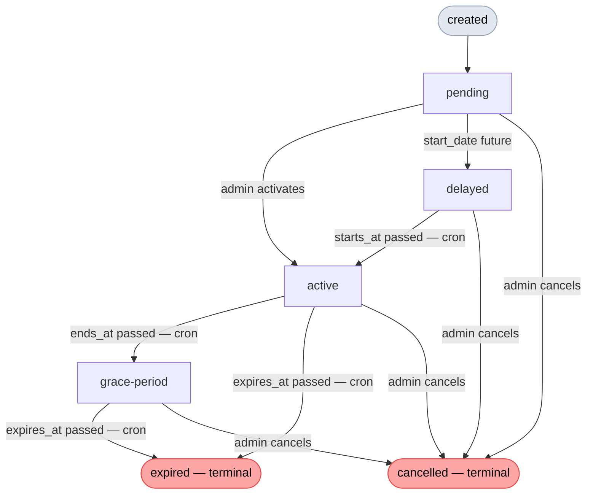

# Bundle Lifecycle

A membership bundle moves through a defined set of statuses from creation to expiry or cancellation. Understanding this lifecycle is essential for working with status transitions, cancellation options, and the renewal flow.

## Status reference

| Status | Slug | Meaning |
|---|---|---|
| Pending | `pending` | Created but not yet activated by an admin |
| Active | `active` | Within the paid membership period |
| Delayed | `delayed` | Start date is in the future |
| Grace Period | `grace-period` | Past the end date but within the configured grace window |
| Expired | `expired` | Past the grace period; access ended |
| Cancelled | `cancelled` | Terminated manually or programmatically — terminal |

Use the `Wicket_Memberships::STATUS_*` constants in code rather than raw strings:

```php
Wicket_Memberships::STATUS_PENDING    // 'pending'
Wicket_Memberships::STATUS_ACTIVE     // 'active'
Wicket_Memberships::STATUS_DELAYED    // 'delayed'
Wicket_Memberships::STATUS_GRACE      // 'grace-period'
Wicket_Memberships::STATUS_EXPIRED    // 'expired'
Wicket_Memberships::STATUS_CANCELLED  // 'cancelled'
```

## Status transition map



### Which transitions are manual vs. automatic

| Transition | Trigger |
|---|---|
| `pending → active` | Admin action (UI or REST API) |
| `pending → cancelled` | Admin action |
| `delayed → active` | Daily cron (`daily_bundle_activation_hook`) |
| `delayed → cancelled` | Admin action |
| `active → grace-period` | Daily cron (`daily_bundle_grace_period_hook`) |
| `active → cancelled` | Admin action |
| `grace-period → expired` | Daily cron (`daily_bundle_expiry_hook`) |
| `grace-period → cancelled` | Admin action |
| `expired`, `cancelled` | Terminal — no further transitions |

::: tip
`expired` is never offered in the admin UI status selector. It is set exclusively by the daily expiry cron. `delayed → active` and `active → grace-period` are similarly cron-only.
:::

## WooCommerce subscription states

Each bundle has exactly one WooCommerce subscription. Its state changes in step with the bundle status:

| Bundle status | WC subscription state | Notes |
|---|---|---|
| `pending` | `pending` | Created at bundle creation; activated on `pending → active` |
| `delayed` | `pending` | Not yet activated; activation deferred to `starts_at` date |
| `active` | `active` | Activated when bundle goes active; drives renewal payments for `subscription` renewal type |
| `grace-period` | `active` | Subscription stays active during grace period — it may still process a renewal payment |
| `expired` | `active` or `cancelled` | Expiry does not touch the subscription; it depends on whether a renewal payment occurred |
| `cancelled` (immediately) | `cancelled` | Hard-cancelled at cancellation time |
| `cancelled` (at end date) | `pending-cancel` → `cancelled` | Set to `pending-cancel` immediately; a scheduled Action Scheduler job hard-cancels at `ends_at` |

## Cron-driven transitions

Three Action Scheduler recurring jobs run once per day and drive automatic transitions.

### `daily_bundle_grace_period_hook`

Finds all `active` bundles whose `membership_ends_at` is before yesterday (UTC) and transitions each to `grace-period`. Cascades the new status to all non-cancelled child individual memberships.

### `daily_bundle_expiry_hook`

Finds all `active` or `grace-period` bundles whose `membership_expires_at` is before yesterday (UTC) and transitions each to `expired`. If a bundle has no grace period configured, `membership_expires_at` equals `membership_ends_at`, so it expires immediately after the end date passes.

### `daily_bundle_activation_hook`

Finds all `delayed` bundles whose `membership_starts_at` is before yesterday (UTC) and transitions each to `active`. This is a status-only change — no dates are rewritten.

### Date trigger jobs (AutomateWoo hooks)

Beyond status transitions, three one-time Action Scheduler jobs fire `do_action` hooks at specific points in the bundle's lifecycle. These do not change status — they are entry points for AutomateWoo triggers and any custom hook listeners.

| Date reached | Hook fired | Use case |
|---|---|---|
| `early_renew_at` | `wicket_memberships_bundle_renewal_period_open` | Notify owner that renewal is open |
| `ends_at` | `wicket_memberships_bundle_end_date_reached` | Send end-of-term notices |
| `expires_at` | `wicket_memberships_bundle_grace_period_expired` | Send post-expiry notices |

These jobs are scheduled when a bundle is created and rescheduled whenever its dates are edited. Editing dates will cancel any pending jobs and replace them.

## Status transitions in code

Call `transition_to()` on a `Membership_Bundle` instance to perform a status change. This method applies lifecycle guards, recalculates dates where applicable, activates the WooCommerce subscription on `pending → active`, and cascades the new status to all child individual memberships.

```php
$bundle = new \Wicket_Memberships\Membership_Bundle( $bundle_post_id );
$result = $bundle->transition_to( 'active' );

if ( $result === false ) {
    // Transition not allowed from current status
}

// $result['success_message'] — confirmation string
// $result['bypassed']        — true only when BYPASS_STATUS_CHANGE_LOCKOUT is set
```

To check which transitions are valid before calling:

```php
$transitions = $bundle->get_allowed_status_transitions();
// Returns [ 'active' => [ 'name' => 'Active', 'slug' => 'active' ], ... ]
// Returns [] when the bundle is in a terminal status
```

## Cancellation paths

Cancellation supports three distinct behaviours, controlled by the `member_handling` and `timing` parameters on the cancel endpoint (or `cancel_bundle()` in the admin controller).

### Path A — Cancel all, immediately

All child memberships are cancelled immediately. The WooCommerce subscription is hard-cancelled. Dates are collapsed to now.

```php
Membership_Bundle_Admin_Controller::cancel_bundle(
    bundle_post_id:   $bundle_post_id,
    member_handling:  'cancel_all',
    timing:           'immediately',
);
```

### Path B — Cancel all, at end date

The bundle status becomes `cancelled` but the existing `ends_at` is preserved. Child memberships retain their `active` status and keep access until the original end date. The subscription is set to `pending-cancel` and a deferred Action Scheduler job hard-cancels it at `ends_at`.

```php
Membership_Bundle_Admin_Controller::cancel_bundle(
    bundle_post_id:   $bundle_post_id,
    member_handling:  'cancel_all',
    timing:           'at_end_date',
);
```

### Path C — Keep as individual

Each active bundle member is converted to a standalone individual membership that inherits the remaining bundle term (same `ends_at`, `expires_at`, and `early_renew_at`). The bundle itself is cancelled. Each released member gets their own WooCommerce order and subscription.

```php
Membership_Bundle_Admin_Controller::cancel_bundle(
    bundle_post_id:   $bundle_post_id,
    member_handling:  'keep_as_individual',
    timing:           '',   // not applicable for this path
);
```

Non-fatal per-member errors (e.g. a user account cannot be resolved) are collected in the response `warnings` array without blocking the rest of the conversion.

## Renewal flow

### Renewal timing types

The renewal flow behaves differently depending on *when* the renewal payment is processed relative to the current bundle term:

| Type | When it happens | Example |
|---|---|---|
| **Same-day renewal** | Payment processed on or after `ends_at` — the old term has already ended | Subscription auto-renews on the exact end date |
| **Grace-period renewal** | Payment processed after `ends_at` but while the bundle is still in `grace-period` status | Member pays late, within the configured grace window |
| **Early renewal** | Payment processed before `ends_at` — the old term is still active | Member renews 30 days early via the renewal window |

The key difference: for **early renewals**, the old bundle must stay active until the new term starts. The new bundle is created in `delayed` status and only activates when its `starts_at` date is reached. For **same-day and grace-period renewals**, the old bundle is cancelled and the new one is activated immediately once member provisioning completes.

### Renewal steps

When a bundle renews via a WooCommerce subscription payment, `Membership_Controller::handle_bundle_renewal()` orchestrates the following:

1. A new `wicket_mship_bundle` post is created via `Membership_Bundle::renew_bundle()`, carrying the same `membership_bundle_group_uuid` as the original. The new bundle starts in `delayed` status.
2. An Action Scheduler batch job (`wicket_bundle_renewal_process_members`) provisions individual membership records on the new bundle for each seat from the previous term.
3. When all batches complete, `wicket_memberships_bundle_renewal_complete` is fired. The old bundle is then cancelled via `cancel_for_renewal()` — this **does not** cascade cancellation to child individual memberships, because those records are historical.
4. **Same-day and grace-period renewals:** the new bundle is activated immediately via `transition_to('active')`, cascading `active` status to all new child memberships.  **Early renewals:** activation is deferred — the old bundle stays active, and a scheduled Action Scheduler job fires at `new_bundle.starts_at` to cancel the old bundle and activate the new one.

The `membership_bundle_group_uuid` field links all renewal-term posts into a series. Use this UUID (not the post ID) when you need to reference the full history of a bundle across renewal terms.

```php
$group_uuid = $bundle->get_bundle_group_uuid();

// All posts in the series:
$posts = get_posts([
    'post_type'  => 'wicket_mship_bundle',
    'meta_key'   => 'membership_bundle_group_uuid',
    'meta_value' => $group_uuid,
    'orderby'    => 'date',
    'order'      => 'DESC',
]);
```

## Status cascade to child memberships

Every status transition on a bundle — whether manual or cron-driven — cascades the new status to all child individual memberships via `cascade_status_to_members()`. Members already in `cancelled` status are skipped; they are in a terminal state and should not be touched.

This means that when a bundle expires, all its active members also move to `expired` automatically. When a bundle is activated, all its members move to `active`. No separate action is required.
