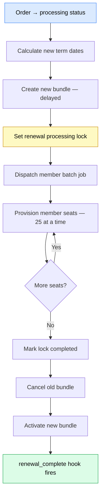

## Overview

Bundle renewal is triggered when a WooCommerce order enters **processing** status (`woocommerce_order_status_processing`). The plugin checks whether the order's subscription has a bundle linked to it — if so, `handle_bundle_renewal()` runs. The process creates a new `wicket_mship_bundle` post that reuses the existing WC subscription, calculates a fresh membership term anchored to the old bundle's end date, and re-provisions all member seats from the previous term into the new bundle. Once all seats are transferred, the old bundle is cancelled (without touching child membership records) and the new bundle is activated. The `membership_bundle_group_uuid` shared between both posts ties the two terms into a continuous renewal series.

## Renewal types

This document covers **subscription auto-renewal** — the path taken when a WooCommerce order moves to `processing` status (`woocommerce_order_status_processing`). The plugin detects whether the order belongs to a bundle subscription and routes it into `handle_bundle_renewal()`. Manual renewals initiated from a member-facing form page follow a different entry point and are not described here.

See [Renewal Types](./renewal-types.md) for a full explanation of all renewal scenarios and when each applies.

## Step-by-step flow



1. **Order enters processing** — WooCommerce fires `woocommerce_order_status_processing`. `Membership_Controller::catch_order_completed()` checks whether the order's subscription has a bundle linked to it (`membership_bundle_id` post meta). If so, `handle_bundle_renewal()` is called with the bundle post ID, subscription, and order.

2. **Date calculation** — `Membership_Bundle_Config::get_membership_dates()` computes the new term dates anchored to the old bundle's `membership_ends_at`. This produces four date values for the new term: `starts_at`, `ends_at`, `expires_at`, and `early_renew_at`.

3. **New bundle created** — `Membership_Bundle::renew_bundle()` inserts a new `wicket_mship_bundle` post. The existing WC subscription is reused — its dates are updated rather than a new subscription being created. The new bundle inherits the same `membership_bundle_group_uuid` as the old one and is created in `delayed` status.

4. **Early vs same-day detection** — if the current date is before the old bundle's `ends_at`, the renewal is classified as early. If today is on or after `ends_at`, it is a same-day or grace-period renewal. This classification determines timing of activation and old-bundle cancellation (see [Early vs same-day renewal](#early-vs-same-day-renewal)).

5. **Lock set** — `membership_renewal_processing` post meta is written to the new bundle post. While this meta exists without a `completed_at` field the bundle is considered in-processing. The React admin UI detects this state and renders `RenewalProcessingOverlay`, blocking all mutations until the lock is released (see [The renewal lock](#the-renewal-lock)).

6. **Batch job dispatched** — Action Scheduler enqueues `wicket_bundle_renewal_process_members` with `{ new_bundle_post_id, old_bundle_post_id, offset: 0 }`. Each batch processes up to 25 member seats.

7. **Batch processing** — `Membership_Bundle_Cron_Controller::process_bundle_renewal_members()` iterates over the WC subscription line items on the old bundle (up to 25 per execution). For each line item it resolves the `_membership_post_id` meta, then calls `Membership_Bundle_Admin_Controller::add_member()` on the new bundle with `is_renewal: true`. The `is_renewal` flag causes `add_member()` to skip creating a new subscription line item since the subscription is already shared. After each seat, `processed_count` and `offset` in the lock meta are incremented. Per-seat failures are recorded in the `errors` array and processing continues for remaining seats. When `offset >= total_count`, `completed_at` is written to the lock meta and the lock is released.

8. **Old bundle cancelled** — `cancel_old_bundle_after_renewal()` calls `Membership_Bundle::cancel_for_renewal()` on the old bundle. This cancels the old bundle post without cascading the cancelled status to its child `wicket_membership` records — those posts are preserved as historical records. For early renewals, this cancellation is deferred to the new bundle's `starts_at` via a scheduled Action Scheduler job (`wicket_bundle_cancel_old_on_new_starts`).

9. **New bundle activated** — For same-day and grace-period renewals, `transition_to('active')` is called immediately after batch completion. This cascades the `active` status to all child memberships on the new bundle. For early renewals, the new bundle remains in `delayed` status until `starts_at` is reached, at which point the `daily_bundle_activation_hook` cron job activates it.

10. **Completion hook fires** — `wicket_memberships_bundle_renewal_complete` is fired after batch completion and old-bundle cancellation, signalling that the full renewal cycle is done.

## Early vs same-day renewal

Whether today is before or after the old bundle's `ends_at` changes the timing of activation and cancellation. In both cases the new bundle is initially created in `delayed` status.

| Scenario | New bundle status | Old bundle cancelled | New bundle activated |
|---|---|---|---|
| Same-day / grace-period | `delayed` → `active` immediately | Immediately after batch | Immediately after batch |
| Early renewal | `delayed` until `starts_at` | At new bundle's `starts_at` | By daily cron at `starts_at` |

For early renewals there is a window where both the old and new bundles exist simultaneously. The old bundle remains active and in service until `starts_at`, at which point the `wicket_bundle_cancel_old_on_new_starts` scheduled job cancels it and the daily cron activates the new bundle.

## The renewal lock

The `membership_renewal_processing` post meta on the new bundle post acts as a distributed lock for the batch operation. It is written in step 5 and released when `completed_at` is set in step 7.

| Field | Type | Description |
|---|---|---|
| `started_at` | string (ISO 8601) | Timestamp when the lock was acquired |
| `total_count` | int | Total number of member seats to process |
| `processed_count` | int | Running count of seats processed so far |
| `offset` | int | Current pagination offset into the subscription line items |
| `errors` | array | Per-seat error messages for seats that failed to provision |
| `completed_at` | string (ISO 8601) | Set when batch finishes; presence releases the lock |

While the lock is active (meta present, no `completed_at`), the React admin UI renders `RenewalProcessingOverlay` over the bundle detail view, disabling all mutation controls.

::: warning
Do not manually delete `membership_renewal_processing` meta from a bundle post while batch processing is still running. The `offset` value in this meta is what makes batch retries idempotent — already-processed seats are skipped on retry. Clearing the meta mid-flight will cause seats processed so far to be re-provisioned on the next batch execution, resulting in duplicate membership records.
:::

## Historical records

Old bundles and their child `wicket_membership` posts are never deleted during renewal. When `cancel_for_renewal()` cancels the old bundle, it cascades `cancelled` to all child individual memberships — old-term seats are unambiguously terminal and will not appear in active-membership queries alongside the new term's seats.

::: tip
`get_individual_memberships( active_only: false )` on the old bundle still returns the full historical member list — cancelled members are included when `active_only` is false, so renewal history remains queryable.
:::

The `membership_bundle_group_uuid` meta value is shared across every renewal term in a series. This allows the full renewal history for a given membership group to be retrieved in a single query:

:::details Retrieve full renewal history for a group UUID

```php
$posts = get_posts([
    'post_type'  => 'wicket_mship_bundle',
    'meta_key'   => 'membership_bundle_group_uuid',
    'meta_value' => $group_uuid,
    'orderby'    => 'date',
    'order'      => 'DESC',
]);
```

Results are ordered newest-first. The most recent post is the current active term; earlier posts are historical records.

:::

::: tip
Because historical records are preserved, reporting on membership continuity (consecutive renewals, lapsed members, reinstatements) can be built directly from the `wicket_mship_bundle` and `wicket_membership` post tables without needing a separate audit log.
:::

## Failure handling

**Per-seat errors** — if an individual member seat cannot be provisioned (user cannot be resolved, or the assigned tier is invalid), the error is recorded in the `errors` array of `membership_renewal_processing` meta and processing continues for all remaining seats. The renewal is not aborted. After batch completion, an admin note is added to the WooCommerce renewal order listing each failed seat so that site administrators can take corrective action.

**Batch job failures** — if the Action Scheduler job itself fails (PHP fatal error, memory exhaustion, timeout), Action Scheduler will re-queue the job according to its configured retry policy. Because `offset` in the lock meta advances only after a seat is successfully processed, retries are safe to run — seats whose `offset` has already been passed are skipped, preventing double-provisioning.

**Stale locks** — if a batch job exhausts all retries without completing, `membership_renewal_processing` will remain on the bundle post without `completed_at`, keeping the bundle in the processing state indefinitely. In this scenario an administrator must investigate the Action Scheduler failure logs, resolve the underlying cause, and either re-trigger the job manually or clear the lock meta once it is confirmed safe to do so.

::: danger
A stuck lock with no running batch job will prevent any admin mutations on the new bundle for as long as it persists. Do not clear the lock without first confirming that no batch job is actively executing.
:::

## Hooks fired during renewal

| Hook | When | Args |
|---|---|---|
| `wicket_memberships_bundle_renewal_complete` | After batch completes and old bundle is cancelled | `$new_bundle_post_id, $old_bundle_post_id` |
| `wicket_bundle_cancel_old_on_new_starts` | Early renewal only — fires at new bundle's `starts_at` | `$new_bundle_post_id, $old_bundle_post_id` |
