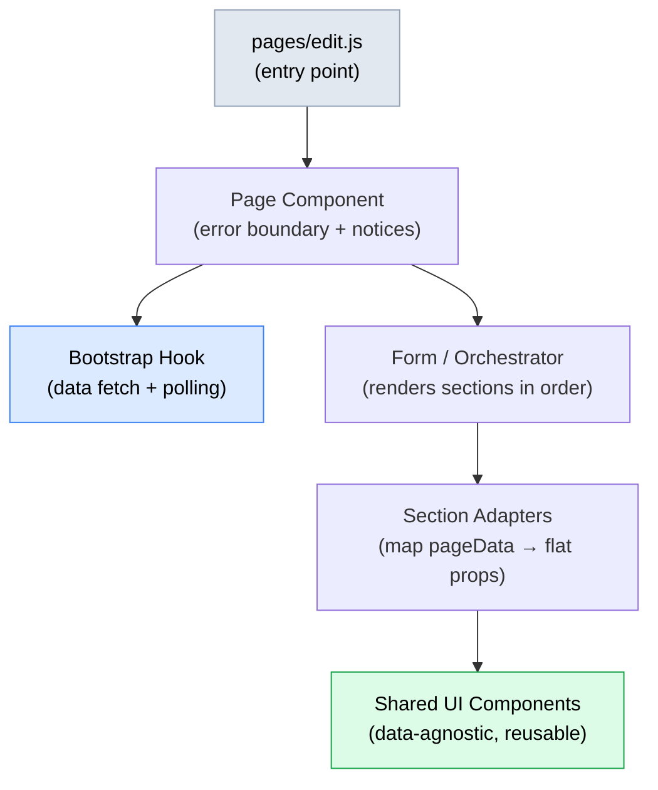

# Architecture & Patterns

## Adapter + Orchestrator + Sections Pattern

Modern pages (membership bundles, bundle configs, create bundle) follow a strict layered architecture. Each layer has a single responsibility and dependencies only flow downward.

**Layer 1 — Entry point** (`pages/edit.js`, `pages/create.js`)

A thin file: one `getElementById`, one `createRoot().render()`. No logic. Spreads `dataset` as props onto the page component.

**Layer 2 — Page component** (`MembershipBundlePage`, `BundleConfigPage`)

Owns the error boundary (`AdminPageErrorBoundary`) and the notice stack (`AdminNoticeStack`). Calls the bootstrap hook to fetch all page data. Passes data and callbacks down to the form/orchestrator. Resets the error boundary key when the user clicks "Try again".

**Layer 3 — Form / Orchestrator** (`MembershipBundleForm`, `BundleConfigForm`)

Renders section components in declared order. Holds no data of its own — receives `pageData` and callbacks from the page component and passes subsets down to sections.

**Layer 4 — Section adapters** (`IntroBlockSection`, `MembershipBundleOwnerSection`, `ApprovalSection`, …)

One adapter per logical section of the page. Maps `pageData` to the flat props that a shared UI component expects. Contains no JSX of its own beyond the shared component invocation. This isolation means the shared component never needs to know the shape of `pageData`.

**Layer 5 — Shared UI components** (`IntroBlock`, `MembershipOwnerSection`, `CycleSection`, …)

Data-agnostic, reusable components in `src/shared/components/`. Accept only flat, typed props. Have no knowledge of API response shapes.

:::details Call chain — membership bundle page

```
pages/edit.js
  └─ MembershipBundlePage          (error boundary + notices)
       └─ useMembershipBundleBootstrap  (data fetch + polling)
       └─ MembershipBundleForm      (orchestrator — renders sections)
            ├─ IntroBlockSection    (adapter → IntroBlock)
            └─ MembershipRecordsSection
                 ├─ MembershipBundleOwnerSection  (adapter → MembershipOwnerSection)
                 ├─ BundleMembersSection
                 └─ MembershipBundleRecordDetails
```
:::

## Component Layer Diagram



## Bootstrap Hooks

Each modern page has exactly one bootstrap hook that encapsulates all data fetching and loading/error state. Nothing outside the hook calls the API on initial load.

**`useMembershipBundleBootstrap`** (`src/membership_bundles/hooks/useMembershipBundleBootstrap.js`)

Fetches the full bundle edit page payload from `GET /wicket_member/v1/bundle/admin/get_edit_page_info`. Returns `{ pageData, setPageData, requestState, retryLoad, renewalProcessingMeta }`. While a renewal batch is in progress (`membership_renewal_processing` meta present with no `completed_at`), the hook polls the endpoint every 10 seconds via a silent background refresh that does not reset `requestState` to loading — so the overlay can update progress without re-rendering the full page skeleton.

**`useBundleConfigBootstrap`** (`src/membership_bundle_configs/hooks/useBundleConfigBootstrap.js`)

Manages three parallel loading states: `recordRequest` (the saved config post), `postsRequest` (WP pages), `productsRequest` (WC products). Returns lazy loaders (`loadPostOptions`, `loadProductOptions`) that the form calls on demand. Returns `isRecordReady` so the form can defer rendering until the saved post has loaded.

:::details Usage pattern

```js
// In the page component (BundleConfigPageContent)
const {
  form,
  setForm,
  recordRequest,
  loadPostOptions,
  loadProductOptions,
  isRecordReady,
} = useBundleConfigBootstrap({ postId, bundleConfigCptSlug, languageCodes, defaultForm });

// Loading state drives AdminNoticeStack notices, not a spinner overlay
const notices = [
  ...(recordRequest.status === "error" ? [{ id: "record-error", ... }] : []),
  ...submitErrors.map(...),
];
```
:::

## Data Flow

There is no global state library (no Redux, Zustand, or Context). Data flows in one direction via props drilling.

```
Bootstrap hook
  │  pageData, setPageData, requestState
  ▼
Page component
  │  pageData, isLoading, callbacks (onOwnerUpdated, onMemberAdded, …)
  ▼
Form / Orchestrator
  │  pageData, isLoading, callbacks
  ▼
Section adapters
  │  flat props mapped from pageData
  ▼
Shared UI components
  │  user action
  ▲
  └─ callback prop fires → propagates up to page component
        page component calls setPageData to update local state
        (no re-fetch unless the user explicitly triggers one)
```

::: tip
The page component is the single source of truth for `pageData`. Callbacks that mutate a small slice of data (e.g. `onOwnerUpdated`) do an optimistic `setPageData` merge rather than a full re-fetch so the page does not flicker.
:::

## Modal-Driven Workflows

Workflows that require multi-step user input are handled in dedicated modal components. Each modal owns its own form state internally. The parent passes a `onSuccess` / `onRequestClose` callback; on success the modal calls back and the parent decides whether to refresh, show a notice, or both.

| Modal | Workflow |
|---|---|
| `AddMemberToBundleModal` | Add a new MDP person to a bundle by selecting user, tier, and product |
| `CancelMembershipBundleModal` | Cancel a bundle with configurable member handling (cancel all or keep as individual) and timing (immediately or at end date) |
| `CreateBundleRenewalOrderModal` | Create a WooCommerce renewal order off the bundle's existing subscription |
| `ManageStatusModal` (legacy) | Transition an individual membership to a new status |
| `ApprovalCalloutModal` (legacy) | Edit the approval callout text for a membership tier |
| `SeasonConfigModal` (legacy) | Add or edit a calendar season on a membership config |

::: warning
Modals in the legacy pages (`src/members/edit.js`, `src/membership_tiers/edit.js`) manage their state inside the monolithic root component. Modals in modern pages are standalone components that receive only what they need via props.
:::

## API Service Layer

All HTTP calls go through `src/shared/services/api.js`. Every exported function calls `apiFetch` from `@wordpress/api-fetch`, which handles nonce authentication automatically via the WordPress REST API nonce injected by `wp_localize_script`.

Three URL namespace constants are defined in `src/shared/constants.js`:

| Constant | Value | Used for |
|---|---|---|
| `PLUGIN_API_URL` | `/wicket_member/v1` | Plugin-specific endpoints (members, bundles, tiers, status) |
| `API_URL` | `/wp/v2` | WordPress core REST API (posts, pages) |
| `WC_API_V3_URL` | `/wc/v3` | WooCommerce product and variation data |

A fourth constant, `BASE_PLUGIN_API_URL` (`/wicket-base/v1`), is used for MDP organisation search calls that are handled by the `wicket-wp-base-plugin` dependency.

:::details Example — two namespaces in one hook

```js
// useBundleConfigBootstrap calls both namespaces
const post = await apiFetch({ path: `${API_URL}/${bundleConfigCptSlug}/${postId}` }); // /wp/v2
const products = await fetchWcProducts({ status: "publish", per_page: -1 });           // /wc/v3
```
:::

## Styling

All components use [styled-components](https://styled-components.com/) (v6). There is no separate CSS file system.

**Global reusable elements** are exported from `src/shared/styled_elements.js` and imported by any component that needs them:

| Export | Purpose |
|---|---|
| `AppWrap` | Outermost page wrapper; inlines the react-datepicker CSS via `raw-loader` |
| `EditWrap` | `max-width: 1000px` content column for edit pages |
| `Wrap` | `max-width: 600px` content column for narrower forms |
| `FormFlex` | Row flex container with `margin-top: 15px` and responsive stacking |
| `BorderedBox` | `1px solid #c3c4c7` card with padding |
| `ActionRow` | Spacer row above submit buttons |
| `ErrorsRow` | Wrapper for notice/error stacks |
| `LabelWpStyled` | Uppercase 11px form label matching WordPress admin style |
| `SelectWpStyled` | `react-select` styled to match WP admin input height (30px) |
| `AsyncSelectWpStyled` | Same as above but for async selects |
| `ReactDatePickerStyledWrap` | Date picker container with WP-style input dimensions |
| `ModalStyled` | `@wordpress/components` Modal with `overflow: visible` for dropdowns |
| `RecordTopInfo` | Light blue (`#F0F6FC`) info panel at top of record |
| `MembershipTable` | Striped membership records table with billing sub-table |
| `CustomDisabled` | `Disabled` wrapper at 50% opacity |

Component-level styles that are not reused elsewhere are defined as `styled.*` constants inline in the component file.

## Build System

The frontend uses [`@wordpress/scripts`](https://developer.wordpress.org/block-editor/reference-guides/packages/packages-scripts/) (wp-scripts), which wraps webpack with WordPress-specific defaults.

A local `frontend/webpack.config.js` extends the default config to:
- Add `raw-loader` for `.css` files (used to inline react-datepicker CSS into `AppWrap`)
- Declare all ten [entry points](./index#webpack-entry-points)

| Command | Effect |
|---|---|
| `npm run start` | Incremental dev build with watch mode |
| `npm run build` | Production build (minified, hashed) |

Run both commands from the `frontend/` directory.

Built assets in `frontend/build/` are committed to the repository. Each entry produces a `.js` file and an `.asset.php` file (auto-generated dependency manifest). The PHP admin controller enqueues the `.js` using the `.asset.php` dependencies list.

::: warning
Never edit files in `frontend/build/` manually. They are regenerated on every build and your changes will be overwritten.
:::

## Error Handling

Error handling operates at three levels:

**`AdminPageErrorBoundary`** (`src/shared/components/AdminPageErrorBoundary.js`)

A React class component that wraps each modern page component. Catches uncaught render errors and replaces the page with a "Try again" notice. The page component passes a `resetKey` prop — incrementing it clears the error boundary state and re-mounts the subtree.

**`AdminNoticeStack`** (`src/shared/components/AdminNoticeStack.js`)

Renders an ordered list of `@wordpress/components` `Notice` components. Used for API errors (load failures, save failures) and transient success messages. The page component builds the notices array from `requestState` and user-triggered events, then passes it as a prop. Each notice can optionally carry an `action` (a retry button) and an `onDismiss` handler.

**Inline validation**

Forms collect validation errors before submission and surface them through the same `AdminNoticeStack` using `submitErrors` state. The `BundleConfigPage` validates that required fields are present before calling `apiFetch`.

## Polling

`useMembershipBundleBootstrap` detects an active renewal batch by checking whether the `membership_renewal_processing` post meta is present and has no `completed_at` value. When this condition is true after an initial or retry load, the hook schedules a `setTimeout` for 10 seconds (`RENEWAL_POLL_INTERVAL_MS = 10000`). Each poll calls a silent refresh (`silentRefresh`) that updates `pageData` without toggling `requestState` to `"loading"`.

`RenewalProcessingOverlay` (`src/membership_bundles/components/RenewalProcessingOverlay.js`) reads the `renewalProcessingMeta` value returned by the hook and renders a full-height semi-transparent overlay with a spinning progress indicator when a batch is active. The overlay is scoped to a `position: relative` container so it does not cover the browser chrome. It dismisses automatically when the next poll returns data with `completed_at` set.
